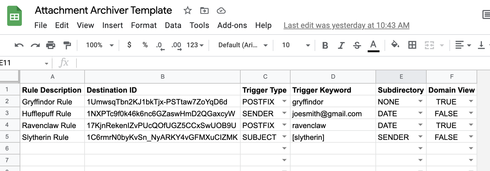

# Attachment Archiver

## What it does
Automatically intercept emails to the active user's inbox and based on configured rules, route message attachments to a specified Google Drive folder. Sheet based configuration allows for updates without needing to change any code.

## Why you would use it
Remove email from any workflow where users process files from senders external to the organization and do not need the ability to communicate in response. Leveraging this script allows for the creation of a centralized email address that can be utilized by multiple teams.

## How it works
The script first looks to a linked Google Sheet for the rules it should process. For each rule (processed in order), it queries the active user's Gmail inbox to find unread messages that match the rule criteria.

Messages that are found to match the query will have their attachments saved to Drive and deposited in a location defined by the rule.

After a message is processed, it is marked as read and archived, which prevents it from being queried again in the future.

## Rules
Rules are contained in a Google Sheet and contain six attributes (that must be listed in this order):
-   Rule Description: A nice name for the rule being executed.
-   Destination ID: The Drive directory ID that should parent where the files are placed.
-   Trigger Type: The criteria that the message will be evaluated against to determine if the rule fits.
-   Trigger Keyword: The keyword that the trigger is looking to match.
-   Subdirectory: Whether or not files should be placed directly into the destination folder or placed in a subdirectory.
-   Domain View: Whether or not everyone in the domain should get view only permission to a file if they have the link.

Feel free to make a copy of this [template rule sheet](https://docs.google.com/spreadsheets/d/15KfB7d7zxDaJvptfWlDezPh7CUzMgPgT8pFfy7gkL0w), which look like:

### Trigger Types
Triggers are the criteria by which a message will be evaluated to see if it matches a rule.
-   POSTFIX: Looking for a specific keyword appended with + to the end of an email address.
-   SENDER: Looking for a specific message sender.
-   SUBJECT: Looking for a specific keyword in the message subject.

### Subdirectory Options
Subdirectory options control how attachments are placed into the destination Drive folder.
-   NONE: Store the files directly in the destination Drive folder provided.
-   DATE: Store the files in a subidrectory by date (YYYY-MM-DD). This is the date the script is run, not the date of the message.
-   SENDER: Store the files in a subdirectory by the message sender.

### Domain View Options
The domain view setting allows for additional permissions to be set on each file.
-   FALSE: No additional permissions will be granted to the entire domain (if they have the link). Only those with inherited permissions will have access.
-   TRUE: Each file will be granted view only permission to the entire domain (if they have the link).

## Scopes and Configuration 

### Requested Scopes
In order for the script to work, it must be initialized and granted the necessary permissions in order to take actions on behalf of the signed-in user:
-   Apps Script (https://www.googleapis.com/auth/script.scriptapp)
-   Drive (https://www.googleapis.com/auth/drive)
-   Gmail (https://mail.google.com)
-   Sheets (https://www.googleapis.com/auth/spreadsheets)

### Configuration
There are 4 variables in the code itself that may require modification before execution:
-   MAX_EMAILS: the maximum size of the Gmail search (default 20).
-   TRIGGER_MINUTES: how often the script runs and checks for new messages (default 15).
-   RULES_SHEET_ID: the ID of the Google Sheet where the Rules can be found.
-   RULES_SHEET_NAME: the name of the workbook tab in the Sheet where the rules can be found.

## Usage
This application consists of two components: an Apps Script project and a Google Sheet. The script is generally expected to be initalized once via manual execution, followed by triggered execution every X minutes. The Sheet can be updated with rules without needing to modify the script.

### Sheet creation and setup
-   Make a copy of this [template rule sheet](https://docs.google.com/spreadsheets/d/15KfB7d7zxDaJvptfWlDezPh7CUzMgPgT8pFfy7gkL0w) OR create a new Google Sheet with 6 columns and a header matching the Rules attributes listed above.
-   Rename the worksheet to 'Rules' or a name of your choosing. This will be required for the script's configuration.
-   Make a note of the script ID found in the URL. This will be required for the script's configuration.
-   Optionally create data validation rules for the Trigger Type and Subdirectory values that map to the attributes listed above.
-   Create your rules.
-   Note that any Drive folders listed in a rule must be shared with the account that will execute the script and own the Gmail inbox.

### Script creation and initilization
-   Create a new Google Apps Script project. Name it 'Attachment Archiver' or a name of your choosing.
-   Copy and paste the code from this repository into the Code.gs script.
-   At minimum, modify the following configuration fields: RULES_SHEET_ID and RULES_SHEET_NAME.
-   Run the initialize() function. Authorize the required scopes.
-   Send a test email to the inbox that matches your configured rules and manually run processRules(). Debug statements will provide insights on matches and actions.

## Watchpoints
-   Rules are executed in order. If a message is caught by an earlier rule, it will not be picked up by a later rule. Consider placing broad rules (e.g. by sender) later in the list.
-   The user account that is going to be executing the script (and own the Gmail inbox) must be granted Editor permission on any Drive folder (destination ID) to which it is going to deposit files.
-   Gmail has a [max attachment size](https://support.google.com/mail/answer/6584). For workflows with files greater than this limit, other methods should be employed.