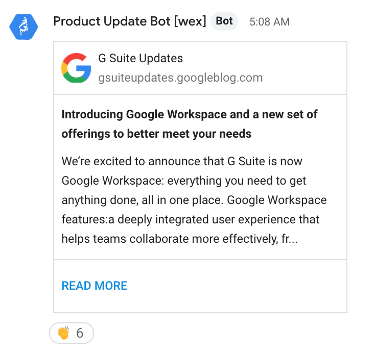

# Google Chat Updates Bot

## What it does
Keep up to date with any feed by having new posts published to a Google Chat room using Apps Script and Webhooks. Feeds included in this example are various official Google blogs.

### Included Feeds
- [Google Workspace Updates](https://workspaceupdates.googleblog.com/)
- [Chrome Releases Blog](https://chromereleases.googleblog.com)
- [Cloud Blog: Training and Certifications](https://cloud.google.com/blog/topics/training-certifications)
- [Google Developers Blog](https://developers.googleblog.com/)

### End result

## Why you would use it
Bring information from feeds directly into your Google Chat room, where members can comment or react directly inline with the content. This might include product updates regarding Google Workspace, code updates from a repository, or news from relevant sources.

## How it works
The script is deployed as a single Apps Script project and file, set to run on a timed trigger. The script requests data from various configured feeds, which are then evaluated as to whether or not they've been seen before by the script. New updates are then broadcast out to configured webooks. Local storage is used to keep track of which posts have been previously seen.

## Scopes and Configuration 

### Requested Scopes
In order for the script to work, it must be initialized and granted the necessary permissions in order to take actions on behalf of the signed-in user:
-   Apps Script (https://www.googleapis.com/auth/script.scriptapp)
-   Apps Script (https://www.googleapis.com/auth/script.external_request)

### Configuration
There are 4 variables in the code itself that may require modification before execution:
-   MAX_CONTENT_CHARS: the length of the article summary that is included in theChat card
-   MAX_INIT_UPDATES: when initializing the script, how many initial posts tosend to a room
-   MAX_CONTENT_UPDATES: the number of new updates to send. Generally does not need to be updated
-   TRIGGER_INTERVAL_HOURS: how often the script will check for updates

### Extensibility
This script was made to handle the various formats of the supported Google blogs. However, it can easily be extended to support other feed formats or webhook platforms. 
-   FEED_FORMAT: a type of feed input, requring a `name` and a `parseFunction`
-   WEBHOOK_PLATFORMS: a type of webook output, requring a `name` and a `viewFunction`

## Usage
This application consists of a single Apps Script project and file. The script is expected to be initalized once via manual execution, followed by triggered execution every X hours. One will also need to set up a webhook in Google Chat (or any other configured channel).

### Create a webhook in Google Chat
1. In a Google Chat room, select 'Configure webhooks'.
2. If one already exists, select 'Add another', otherwise...
3. Enter a name for your webhook. You may want to use 'Google Workspace Updates', or something reflective of the feeds that are being used.
4. Enter an icon for your webhook. You may want to use [this image](https://lh3.googleusercontent.com/proxy/Avi9GdfQQrgH3Iyy7f92yR4NElOpiq46VzMwnCWAFJRvj_GU_r2f2aUdKDNiQfchDKg50O2jj445ohIY_TuGoGyDGWVZVcedIMAwuM7eKX88ymDx40A=s88-c).
5. Save the webhook.
6. Once saved, copy the webhook URL. You'll need this when you setup the script.

### Script creation and initilization
1. Create a new Google Apps Script project. Name it 'Google Chat Updates Bot' or a name of your choosing.
2. Copy and paste the code from [code.js](code.js) into Code.gs within the Apps Script project.
3. Update the configuration directly in the code. At minimum, replace YOUR_WEBHOOK_URL_GOES_HERE with your webhook's URL.
4. Run `initializeScript()` and authorize the required scopes.
5. Run logScriptProperties() to verify local storage is working properly.
6. Check your Google Chat room for your first update.